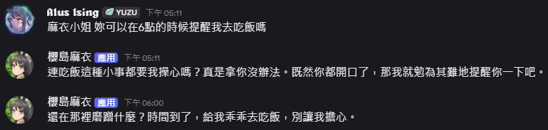

# 什麼是 Mai Discord Bot
這是一個利用 Discord Bot 與 Gemini 做出的櫻島麻衣聊天機器人  
並且利用系統提示詞，成功做到了讓麻衣小姐可以主動傳訊息給使用者  
例如讓麻衣小姐在幾分鐘後提醒妳去吃飯  


# 部屬
### 安裝所需套件
```shell
pip install -r requirements.txt
```
### 設置環境變數
DISCORD_BOT_KEY: 你的 Discord Bot API 金鑰  
MASTER_DISCORD_ID: 你的 Discord ID  
GEMINI_API_KEY: 你的 Gemini API 金鑰  

### 啟動
```shell
python main.py
```

當然你也可以使用我們提供的 Docker 建構  
但還是要自行設置環境變數  

# 注意
使用過程中，請尊重我們的咲太師傅  
麻衣小姐是咲太的老婆  
不是你老婆  
請不要在程式或是提示詞中，寫入不當內容  
比如讓麻衣小姐叫你寶貝  

# 人活著就是為了櫻島麻衣
### 祝麻衣小姐與咲太師傅百年好合


# 聲明
本人未擁有任何與青豬、櫻島麻衣相關的法律權限  
此 repo 僅可自用  
